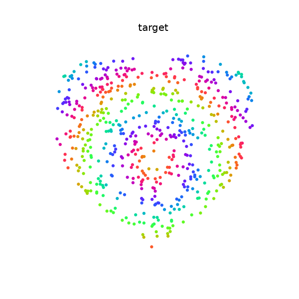
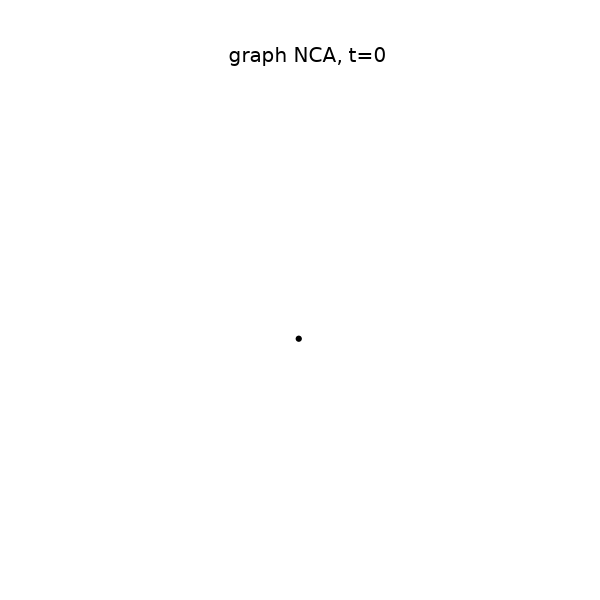

# Graph cellular automata

Distill's [Growing Neural Cellular Automata](https://distill.pub/2020/growing-ca),
but on a random graph instead of a grid. One seed node grows into the whole
pattern, using nothing but messages passed between neighbors.

Live demo: **[gca.texoport.in](https://gca.texoport.in/)**

| Target                           | Rollout                          | Damage and healing               |
| -------------------------------- | -------------------------------- | -------------------------------- |
|  |  |  |

## How it works

A grid CA is already a GNN, just with a fixed lattice and a hand-written rule.
Relax both:

|                       | neighborhood                | rule         |
| --------------------- | --------------------------- | ------------ |
| classic CA            | fixed grid                  | hand-written |
| Neural CA (Distill)   | fixed grid (Sobel conv)     | learned MLP  |
| Graph NCA (this repo) | any graph (message passing) | learned MLP  |

Each node holds 16 numbers: RGB, alpha, and 12 hidden channels. Every step, a
node looks at its own state, the mean of its neighbors, and the mean difference
to its neighbors. A small shared MLP turns that into an update. A random mask
skips about half the nodes each step, so nothing can depend on a global clock.

The rest is the growing-NCA recipe. A sample pool, rollouts of random length,
MSE on RGBA against the target, and alive-masking by max-pooling alpha over
neighbors.

## Healing

Growing and healing turn out to be different skills. A rule trained only to
grow does reach the target, but the basin around it is narrow. Punch a hole in
a finished heart and it refills maybe two thirds of the way, stalls, then rots.

So train on broken patterns. Every step, sort the batch by loss and wreck the
three _best_ samples, zeroing all 16 channels wherever the damage lands.
Hitting the best ones is the trick: the basin worth widening is the one around
the finished pattern, and a sample that was already ruined teaches nothing.

Error after 160 healing steps, same damage regions and same seeds for both:

| damage                 | grow-only rule | trained on damage |
| ---------------------- | -------------- | ----------------- |
| horizontal band        | 0.124          | **0.005**         |
| ball, 25% of pattern   | 0.134          | **0.016**         |
| scattered 25% of nodes | 0.163          | **0.005**         |
| one whole half         | 0.088          | **0.025**         |

Growth improves too, 0.024 against 0.083, so nothing was traded away. The
grow-only rule gets worse over the healing window while the damage-trained one
keeps improving until the clock runs out.

Two damage shapes, neither of which a grid could give you: a ball covering 20
to 50% of the pattern around a random node, and a scattered quarter of the
pattern nodes with no shape at all. Alongside them, rollouts of 48 to 80 steps
since healing takes longer than growing, a pool of 512, noise of 0.02 on the
starting state, and a penalty on states drifting outside [-1, 1]. `--damage 0`
turns all of it off and gives you the plain growing rule back.

The recipe is borrowed. [Growing NCA](https://distill.pub/2020/growing-ca)
damages 3 of 8 samples, [VNCA](https://arxiv.org/abs/2201.12360) damages a
quarter of the batch, [self-classifying MNIST](https://distill.pub/2020/selforg/mnist/)
adds the noise, [E(n)-GNCA](https://arxiv.org/abs/2301.10497) puts the pool on
graphs. None of them study _when_ to start damaging, so this starts at step 0
like they all do.

Related: [Learning Graph Cellular Automata](https://arxiv.org/abs/2110.14237)
(NeurIPS 2021), [Mesh Neural CA](https://meshnca.github.io/),
[E(n)-equivariant GNCA](https://arxiv.org/abs/2301.10497).

## Run it

```sh
uv sync
uv run python -u scripts/train.py --steps 10000 --tag _dmg   # about 2 h on MPS
uv run trackio show                                          # live curves
```

Keep the `-u`, or a redirected log stays empty until the run exits. Checkpoints
and logs land in `runs/`, gifs in `docs/media/`.

Watch `probe_healed` rather than the loss. Loss can fall for hours while
healing stays broken, which is the trap this whole recipe exists to escape.
Every 1000 steps the probe grows the heart, punches a fixed 25% hole, heals for
160 steps, and records the error.

```sh
uv run python scripts/train.py --animate --tag _dmg          # growth.gif
uv run python scripts/eval_damage.py runs/checkpoint.pt runs/checkpoint_dmg.pt
uv run python scripts/export_web.py                          # web/bundle.js
open web/index.html
```

`eval_damage.py` gives every damage shape its own seed and reseeds the model's
random updates per checkpoint, so it compares models rather than luck. Expect a
noise floor of a few thousandths on MPS, where `index_add_` uses atomics and
the summation order varies between runs.

## Things to try

- swap `heart_target` in `src/gnca/targets.py` for your own pattern
- other graphs: grids with holes, small-world rings, trees
- max aggregation instead of mean
- cut edges during training, not just nodes, so the rule survives a rewired
  world and not only a wounded one

A rule trained on one topology fails on every other one, and fails differently
on each. It never learns the heart. It learns the heart on this graph. A grid
CA cannot fail that way, and it is the most interesting thing here.
