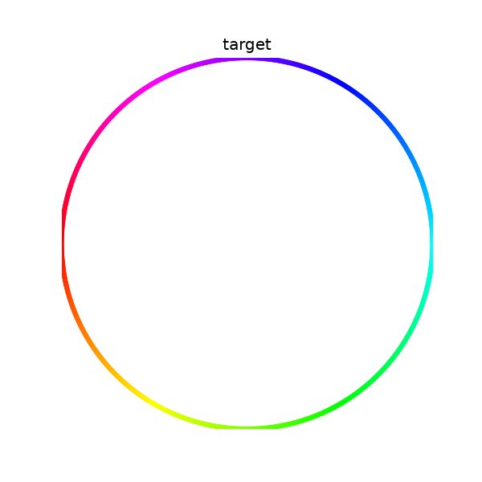
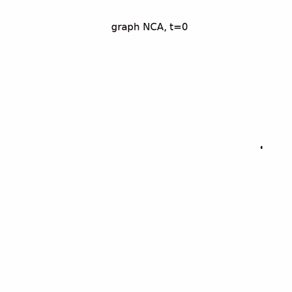

# Graph cellular automata

Distill's [Growing Neural Cellular Automata](https://distill.pub/2020/growing-ca),
but on a random graph instead of a grid. One seed node grows into the whole
pattern, using nothing but messages passed between neighbors.

Live demo: **[gca.texoport.in](https://gca.texoport.in/)**

| Target                           | Rollout                          | Damage and healing               |
| -------------------------------- | -------------------------------- | -------------------------------- |
|  |  |  |

## How it works

A grid CA is already a GNN, just with a fixed lattice and a hand-written rule.
Relax both:

|                       | neighborhood                | rule         |
| --------------------- | --------------------------- | ------------ |
| classic CA            | fixed grid                  | hand-written |
| Neural CA (Distill)   | fixed grid (Sobel conv)     | learned MLP  |
| Graph NCA (this repo) | any graph (message passing) | learned MLP  |

Each node holds 16 numbers: RGB, alpha, and 12 hidden channels. Every step, a
node looks at its own state, the mean of its neighbors, and the mean difference
to its neighbors. A small shared MLP turns that into an update. A random mask
skips about half the nodes each step, so nothing can depend on a global clock.

The rest is the growing-NCA recipe. A sample pool, rollouts of random length,
MSE on RGBA against the target, and alive-masking by max-pooling alpha over
neighbors.

## Healing

Growing and healing turn out to be different skills. A rule trained only to
grow does reach the target, but the basin around it is narrow. Punch a hole in
a finished heart and it refills maybe two thirds of the way, stalls, then rots.

So train on broken patterns. Every step, sort the batch by loss and wreck the
three best samples, zeroing all 16 channels wherever the damage lands. The
basin worth widening is the one around the finished pattern, and a sample that
was already ruined teaches nothing.

Error after 160 healing steps, same damage regions and same seeds for both:

| damage                 | grow-only rule | trained on damage |
| ---------------------- | -------------- | ----------------- |
| horizontal band        | 0.124          | **0.005**         |
| ball, 25% of pattern   | 0.134          | **0.016**         |
| scattered 25% of nodes | 0.163          | **0.005**         |
| one whole half         | 0.088          | **0.025**         |

Growth improves too, 0.024 against 0.083, so nothing was traded away. The
grow-only rule gets worse over the healing window while the damage-trained one
keeps improving until the clock runs out.

Two damage shapes, neither of which a grid could give you: a ball covering 20
to 50% of the pattern around a random node, and a scattered quarter of the
pattern nodes with no shape at all. Alongside them, rollouts of 48 to 80 steps
since healing takes longer than growing, a pool of 512, noise of 0.02 on the
starting state, and a penalty on states drifting outside [-1, 1]. `--damage 0`
turns all of it off and gives you the plain growing rule back.

The recipe is Distill's, near enough exactly: [Growing NCA](https://distill.pub/2020/growing-ca)
also damages the three lowest-loss of eight samples and resets the highest-loss
one to seed. [VNCA](https://arxiv.org/abs/2201.12360) damages a quarter of the
batch, [self-classifying MNIST](https://distill.pub/2020/selforg/mnist/) adds
the noise, [E(n)-GNCA](https://arxiv.org/abs/2301.10497) puts the pool on graphs.

## Cutting edges instead of nodes

Zeroing nodes is the grid's damage, ported. The graph-native version is to cut
edges: every node stays alive, but who can talk to whom changes.


Grow the heart on the full graph, then sever every edge crossing a line and let
it run. Nothing died, and the pattern still comes apart — the rule leaned on
those edges. `damage.py` defines two cuts, a spatial slice and a random
fraction, and nothing trains on either of them yet.

## What the hidden channels hold

Four of the sixteen channels are RGBA. The other twelve are unsupervised, and
the rule is free to put whatever it wants in them. Project them to RGB with PCA
and they turn out to be smooth fields laid over the pattern:


Left is the visible pattern, right is the hidden chemistry driving it. The demo
has the same view behind the **Hidden** toggle.

## Other graphs

The graph does not have to be points in a plane. A Watts-Strogatz ring is a
circle of nodes with a few long-range shortcuts rewired in, so growth creeps
around the ring and occasionally teleports:

| Target                                 | Rollout                                |
| -------------------------------------- | -------------------------------------- |
|  |  |

## Run it

```sh
uv sync
uv run python -u scripts/train.py --steps 10000 --tag _dmg   # about 2 h on MPS
uv run trackio show                                          # live curves
```

Keep the `-u`, or a redirected log stays empty until the run exits. Checkpoints
and logs land in `runs/`, gifs in `docs/media/`.

Watch `probe_healed` rather than the loss. Loss can fall for hours while
healing stays broken, which is the trap this whole recipe exists to escape.
Every 1000 steps the probe grows the heart, punches a fixed 25% hole, heals for
160 steps, and records the error.

```sh
uv run python scripts/train.py --animate --tag _dmg          # growth.gif
uv run python scripts/eval_damage.py runs/checkpoint.pt runs/checkpoint_dmg.pt
uv run python scripts/render/topological_damage.py           # cut edges
uv run python scripts/render/hidden_channels.py              # PCA of channels
uv run python scripts/export_web.py                          # web/bundle.js
open web/index.html
```

`--animate` reloads the checkpoint as-is (positions, edges, seed). You do not
need to re-pass `--nodes` or re-fetch point clouds to render a gif.

`eval_damage.py` gives every damage shape its own seed and reseeds the model's
random updates per checkpoint, so it compares models rather than luck. Expect a
noise floor of a few thousandths on MPS, where `index_add_` uses atomics and
the summation order varies between runs.

## 3-d surface point clouds

The procedural sphere/torus/jack paint a thin shell inside a random cube of
nodes, so only about a fifth of the graph is the pattern. For demos that look
like a real object, sample a mesh surface so every node sits on the shape:

```sh
uv run python scripts/fetch_pointclouds.py          # bunny, spot, teapot, armadillo
uv run python -u scripts/train.py --target bunny --damage 3 --nodes 1536 --tag _pc
uv run python scripts/train.py --animate --target bunny --tag _pc
uv run python scripts/export_web.py runs/checkpoint_bunny_pc.pt \
    --out web/bundle_bunny.js --var BUNDLE_BUNNY
```

Then uncomment the matching `<script src="bundle_bunny.js">` in
`web/index.html`. The Bunny button shows up on its own. Colour is baked from
surface normals (hue by direction), so a regrown ear comes back in a colour you
can check. Same recipe works for `spot`, `teapot`, and `armadillo`.

## Things to try

- swap `heart_target` in `src/gnca/targets.py` for your own pattern
- max aggregation instead of mean
- grids with holes, trees, anything else with an edge list
- cut edges during *training*, not just at eval, so the rule survives a rewired
  world and not only a wounded one
- train on a fresh random graph every episode instead of one fixed graph

Those last two are the interesting ones. Every damage protocol in the NCA
literature I can find breaks node states; none of them break edges.

The rule does not learn the heart. It learns the heart *on this graph* — thin
the edges and the pattern degrades long before any node has died. A grid CA
cannot fail that way, and it is the most interesting thing here.
