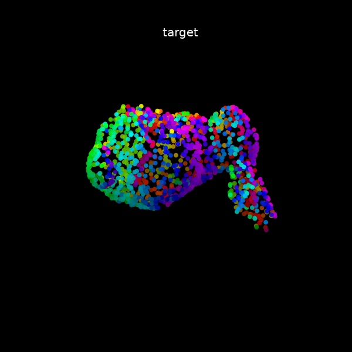
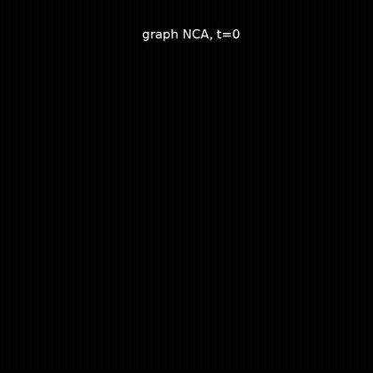
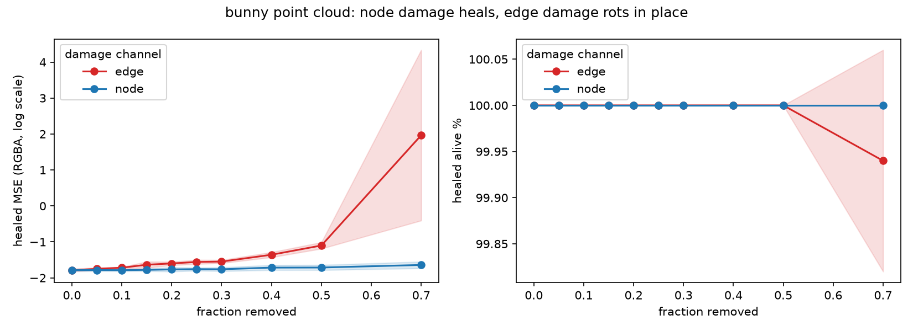

# Graph cellular automata

Distill's [Growing Neural Cellular Automata](https://distill.pub/2020/growing-ca)
on a graph instead of a grid. One seed node grows into the whole pattern using
only messages between neighbors.

Live demo at **[gca.texoport.in](https://gca.texoport.in/)**: Stanford bunny on
a surface point cloud (drag to orbit, click to wound).

| Target | Rollout |
| ------ | ------- |
|  |  |

## How it works

A grid CA is a GNN with a fixed lattice and a hand-written rule. This relaxes
both: any graph, learned rule. Each node holds 16 numbers (RGBA plus 12 hidden
channels). Every step it sees its own state, the mean of its neighbors, and the
mean difference to them; a small shared MLP updates the state. About half the
nodes skip each step so nothing can depend on a global clock.

Training follows the growing-NCA recipe: sample pool, random-length rollouts,
MSE on RGBA, alive-masking by pooling alpha over neighbors. Every step also
wrecks the best samples in the batch, so the rule learns to heal as well as
grow. After 160 grow and 200 heal steps the bunny recovers to MSE 0.015–0.017
from band, ball, scatter, and half cuts, with every node alive.

Related: [Learning Graph Cellular Automata](https://arxiv.org/abs/2110.14237),
[Mesh Neural CA](https://meshnca.github.io/),
[E(n)-equivariant GNCA](https://arxiv.org/abs/2301.10497).

## Run it

```sh
uv sync
uv run python scripts/fetch_pointclouds.py   # once: sample meshes into data/pointclouds/
uv run python -u scripts/train.py \
  --target bunny --nodes 1536 --k 12 \
  --horizon 64 120 --damage 3 --steps 8000 --tag _pc
uv run python scripts/train.py --animate --target bunny --tag _pc
uv run python scripts/eval_damage.py runs/checkpoint_bunny_pc.pt --grow 160 --heal 200
uv run python scripts/export_web.py runs/checkpoint_bunny_pc.pt \
  --out web/bundle_bunny.js --var BUNDLE_BUNNY
open web/index.html
```

`--animate` reloads the checkpoint as-is; you do not need matching `--nodes` or
the raw meshes to render a gif. Watch `probe_healed` more than loss: loss can
fall while regeneration stays broken. Other targets: `spot`, `teapot`,
`armadillo`, plus 2-d patterns (`heart`, `star`, `annulus`, `lobes`, `ring`).

Deploy: `npx wrangler pages deploy web --project-name graph-cellular-automata`.

## Edge damage

A grid CA breaks one way: kill cells. A graph CA also breaks by cutting edges.
Cutting changes no state, so the wound is invisible at the hit (MSE 0.018 at
every fraction) and shows up only as the rule runs on the broken graph. Same
checkpoint, 200 steps to grow and 200 to heal, mean of 5 seeds:

| removed | nodes: healed MSE | edges: healed MSE | edges: alive |
| --- | --- | --- | --- |
| 10% | 0.016 | 0.019 | 100% |
| 25% | 0.018 | 0.028 | 100% |
| 50% | 0.020 | 0.081 | 100% |
| 70% | 0.023 | diverges (4 of 5) | 100% |



Zeroing 70% of the nodes regrows to 0.023; cutting 70% of the edges rots the
pattern while every node stays alive. The rule learns the bunny on this graph,
not the bunny in the abstract. Reproduce with
`uv run python scripts/eval_edges.py`.
